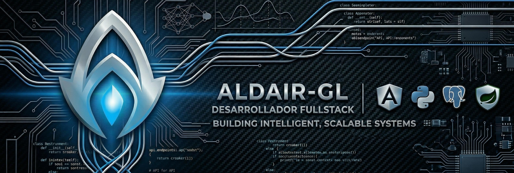

<h1 align="center">¡Saludos! Soy Alejandro “Aldair” Azpeitia 👋</h1>

<h3 align="center">
Desarrollador de Software Multiplataforma · Especialista en soluciones con IA · Diseñador de Videojuegos
</h3>

 

  

  Apasionado por la tecnología, la creatividad y la construcción de experiencias digitales.

---

## 👥 Sobre mí

En **2020** completé mi formación con **Tokio School**, obteniendo la certificación como **Diseñador de Videojuegos**.  
Desde entonces, he seguido desarrollando un perfil que une creatividad, diseño y programación.

En **2024** inicié una **FP Dual Intensiva en Desarrollo de Aplicaciones Multiplataforma (DAM)**, etapa que estoy a punto de finalizar y que me ha permitido consolidar conocimientos en desarrollo backend, desarrollo móvil y tecnologías web modernas.

También he realizado proyectos **freelance** para pequeños negocios, desarrollando soluciones web reales y trabajando tanto en desarrollo full stack como en herramientas como **WordPress**, adaptándome a las necesidades de cada cliente y proyecto.

---

## 🛠️ Stack y tecnologías

### Backend

### Frontend

### Mobile

### Otros

---

## 🌱 Actualmente

- Finalizando mi formación en **DAM**
- Reforzando mi perfil como **desarrollador full stack**
- Creando futuros proyectos para publicar en GitHub
- Explorando nuevas soluciones apoyadas en **inteligencia artificial**

---

## 📬 Encuéntrame en

### Redes

### Profesional

---

## ✨ Enfoque

> Construyo soluciones digitales combinando lógica, creatividad y una visión práctica del desarrollo.
